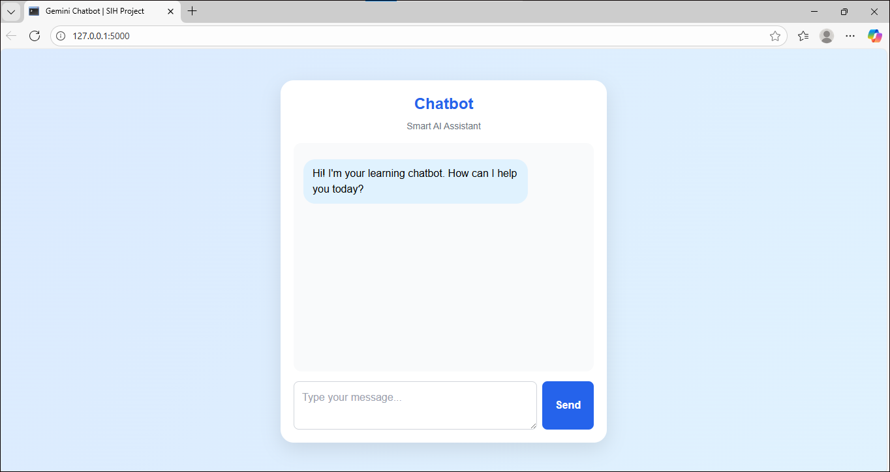

# AI-chatbot

A modern and intelligent **AI Chatbot** interface built for the **Smart India Hackathon (SIH 2025)** problem statement **#25019 — Digital Learning Platform for Rural Students**.  
This chatbot integrates with **API** through a **Flask backend** to deliver smart, interactive learning support for students.

---

## Features

- **API Integration** for intelligent chatbot responses  
- **Real-time conversation** between student and bot  
- **Elegant, responsive UI** (built using Tailwind CSS)  
- Lightweight — just HTML + JS + Flask backend  
- Secure API key handling on the server side  
- Designed for educational use in rural digital learning platforms  

---

## Screenshot

| Chat UI |
|----------|
|  |
---

## Steps :

- 1.Get your API Key
- 2.Add it in your Flask backend (app.py)
## Note : In .env file replace your API key 

## How to Run

1. Clone the repository:
   ```bash
   git clone https://github.com/SailajaSelvam/AI-chatbot.git
   cd AI-chatbot

## Author
## Sailaja S
